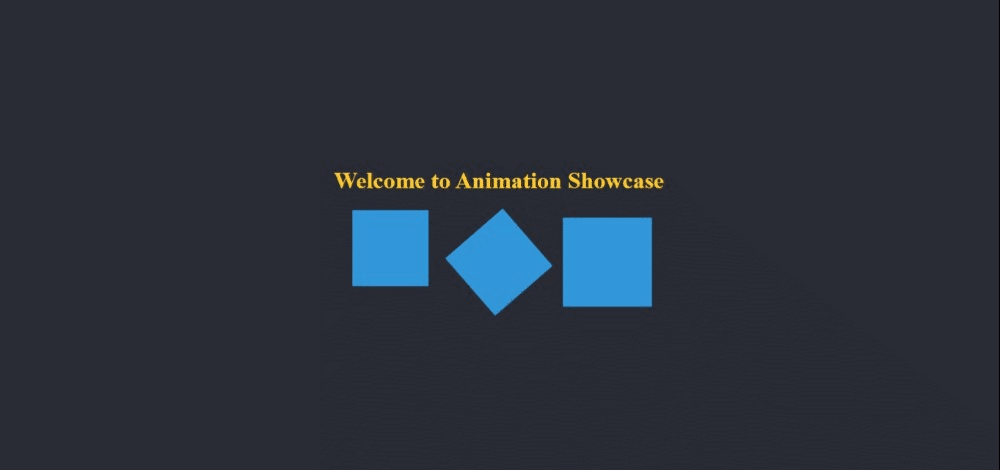

# Animation Showcase

Welcome to the Animation Showcase project! This project combines various CSS animations to create a visually appealing web page.

## How to View the Project

1. Save the HTML code above in a file named `index.html` and the CSS code in a file named `styles.css` on your computer.

2. Open the HTML file in a web browser.

3. You'll see a page with a title that fades in, along with three boxes. These boxes have different animations:
   - The first box bounces up and down.
   - The second box spins continuously.
   - The third box pulsates.

4. Enjoy the interactive animations!

## Customization

You can modify the animations or add more elements with different animations to create your unique visual showcase.

Have fun exploring the animations in this showcase!
