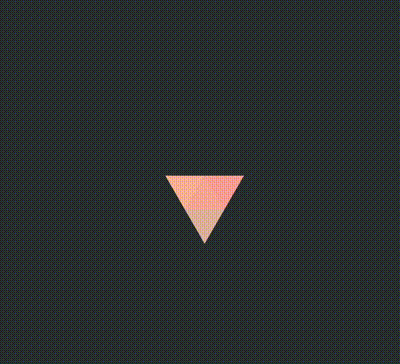

<div align="center">
    <h1> ✨ Animation Nation ✨</h1>
    
    
    
	

</div>
<br />

Welcome to **Animation Nation**, a fun and creative project by the [ZTM Community](https://github.com/zero-to-mastery)! 🎉

This repository is a space where developers of all levels, especially **beginners**,  
can contribute, showcase their creativity.  
Whether you're a seasoned developer or writing your first line of code,  
we'd love to see your animated artwork using only **HTML** and **CSS**

> [!IMPORTANT]
> No **JavaScript** or **images** or **SVG** allowed!

## 🌟 Why Contribute?

- **Gain GitHub experience** by contributing to open-source repositories.
- **Join a supportive community** where you can share your creativity and get feedbacks in our Discord.
- **Enhance your skills** in HTML and CSS while learning GitHub workflows.

## 🎯 Objective Overview

Create an animation using CSS and HTML only (no JavaScript, no SVG).  
A [CSS animation](https://developer.mozilla.org/fr/docs/Web/CSS/animation) refers to the css rule `animation`.

The purpose is to display a creative and looping animation  
_( alike animation in GIFs )_

### Should

- the animation should be looping
- the animation should not require any user interaction ( click, hover, etc ... )

### Should not

An animation should not be:

- a form,
- a portfolio,
- a button to click on,
- a landing page, etc...
  _( which are elements requiring user interaction )_

Here is an example of an expected animation:  


### ☝️ Keep in mind

We keep things simple! Here are the rules for contributing:

- Use **HTML** and **CSS** only. No **JavaScript**. No **Images/SVGs**.
- Your project must include **at least one animation**.
- Don't copy work from others. Make sure your code is **original** so you can showcase your own skills.

## 🚀 How to contribute

> [!TIP]
> 📌 Don't worry if it's your first time contributing—below,  
> we've got detailed steps and resources to help you get started!

### 🔥 Contribution Guide: Step-by-Step

<details>
	<summary>💡 Quick overview of the Development Workflow</summary>

1. **Fork the repo** to your GitHub account.
2. **Clone your fork** to your local machine.
3. **Create a branch**, you should not be working in the main/master branch
4. Create a new directory in the Art directory. Naming it <your_github_username>-<your_arts_name>
5. Create your animated HTML and CSS artwork.
6. Pull down recent changes
7. **Submit a pull request (PR)** with your animated artwork
   _Ensure to review yourself in Github during your PR submission
   before definitely submitting your PR_
8. **OPTIONAL** [Tweet about making your first Hacktoberfest pull request](https://ctt.ac/36L1C), and you're done! 🎉
</details>

#### 1. Fork This Repository

If you're new to GitHub, no worries!  
Forking a repository means creating a copy  
of this project under your GitHub account.  
Check out these beginner-friendly resources for more help:

- [Start Here Guidelines](https://github.com/zero-to-mastery/start-here-guidelines)
- [How to Fork a Repository](https://docs.github.com/en/get-started/quickstart/fork-a-repo)
- [Aldo's Contributing to Github video](https://www.youtube.com/watch?v=uQLNFRviB6Q)

<br>

---

#### 2. Clone Your Fork

Once you've forked the repo, clone it to your local machine  
so you can work on it.
Use this command:

```bash
git clone https://github.com/<your-github-username>/Animation-Nation.git
```

<br>

---

#### 3. Create A Branch

Create a new branch from `master` or `main`
_Working in the `master` or `main` branch is often frowned upon  
and are usually expected to branch off. Branching also helps  
to reduce the chance of a merge conflict._

<br>

---

#### 4. Create Your Artwork

Now for the fun part! Inside the `Art/` folder:

> [!WARNING]  
> It is important to name the directory and your files exactly as mentioned

> [!NOTE]
> Per contribution folder: it should have only 3 files [ `index.html`, `styles.css`, `meta.json` ]

- Create a new directory named:  
  `<github_username>-<art_name>` eg. `mattcsmith-helloworld`.
- Inside **your** folder, create an `index.html` file
- Inside **your** folder, create an `styles.css` file
- Inside **your** folder, create an `meta.json` file  
  to specify your art name, github author and github link  
  Note:
  - copy the following snippet ( without the comment )
  - and replace only the values with your own details.
  - Do not change the JSON keys

```json
// Example
{
  "artName": "triangle",
  "githubHandle": "mattcsmith"
}
```

🎉 Use these to create your **animated artwork** — let your creativity flow!

<br>

---

#### 5. Submit a Pull Request (PR)

After completing your artwork, you are now ready to create  
a pull request and have it added to the collection.

Remembering

- to first **pull down** the recent changes from to the upstream,
- **commit** your changes,
- **push** them to your forked repo,  
  and submit a PR.  
  If you're unfamiliar with pull requests, check out the following resources  
  or drop a message in the Hacktoberfest channel on Discord.
- [Creating a Pull Request](https://docs.github.com/en/github/collaborating-with-issues-and-pull-requests/about-pull-requests)
- [Aldo's Contributing to Github video](https://www.youtube.com/watch?v=uQLNFRviB6Q)

<br>

---

#### 6. OPTIONAL - Tweet about your progress

Optionally you can [Tweet about making your first Hacktoberfest pull request](https://ctt.ac/36L1C) on X

<br>

---

## ⚠️ Important Notes Summary

- You can contribute multiple animations, just create  
  a new directory with your `<github_username>-<art_name>`
- Ensure to have the **3 required files**
- Ensure that you have not modified any other file outside of your own directory
- Ensure that your directory includes an `index.html` and `styles.css`,  
  these **exact names are important**.
- Do **NOT** include any **images**, **SVG**'s or **other files**.  
  Optimized images will be generate automatically  
  to keep the repository at a manageable size.

For maintenance reasons:

- Keep checking regularly your pull requests to address provided reviews  
  Reviewers will take time to check PRs, provide reviews and handle all  
  the repository PRs.

- After a while of no activity after a reviewer gave you reviews:
  - a label `stale` could be set
  - and/or the PR could be closed

---

## 🙌 Let's Connect !

We encourage everyone to share their progress,  
ask for help, or discuss ideas in the ZTM Discord community.  
We're here to support you!

Ready? Let’s make some amazing CSS animations together! 🚀
