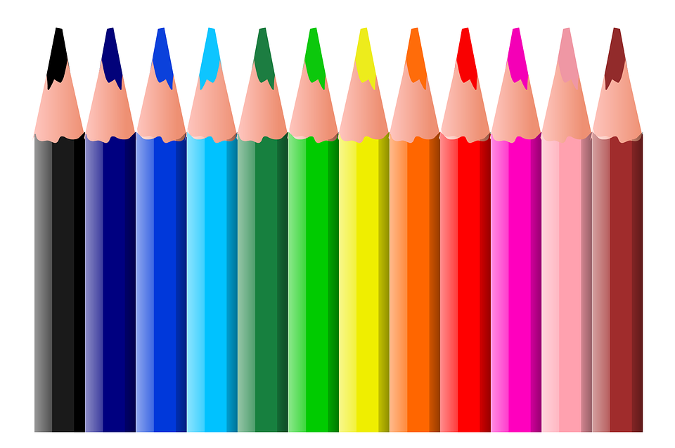

<h1 style="display:flex;justify-content:center;color:">✨ Animation Nation ✨</h1>
<br>
<div align="center">
  
  
  
  <br>
  
  
  <br>

</div>
<br>


_Sharpen your pencils, we're getting creative!_

Hello and welcome to Animation Nation, a ZTM project for Hacktoberfest! This site aims to showcase the creative talents of the ZTM community :)

# Rules

The rules are simple. You have to:

- Use HTML `<divs>` and CSS only! **No JS**, and **no SVGs**!
- Have at least one animation in your work
- Please make sure **that the code is indeed your own, and not copied from someone else**
- That's it!

# How to contribute

## Forking the repo

If you've never forked a repository or made a pull request before, we recommend making your first one over at [https://github.com/zero-to-mastery/start-here-guidelines](https://github.com/zero-to-mastery/start-here-guidelines). That will count towards your total, and then you'll be ready to take on this challenge with your new GitHub skills!

A cool resource to learn about the forking workflow can also be found here - [https://www.atlassian.com/git/tutorials/comparing-workflows/forking-workflow](https://www.atlassian.com/git/tutorials/comparing-workflows/forking-workflow)

## Adding your contribution

Now, once you've forked this repo and got a local version up on your computer, follow these steps:

0. File and folder naming should only contained **letters**, **digits**, **hyphen** (`-`) and/or **underscore** (`_`) - no spaces and prefer lowercase

1. In the `Art/` directory (folder), create a directory **named after your GitHub username**.

2. Within this folder you just made, **create 2 files**, an **HTML** file, and a **CSS** file.

3. **Link your CSS file** to your HTML file.

4. Using **only HTML and CSS** (no `<script>` allowed!!), create a work of art!  
   It can be as simple or as complex as you like, as long as it's animated in some way!

5. Get a screen recording of your finished work, **and make a gif**!  
   Try to **crop it** so that it looks good as a smallish (preferably squarish) image. - squarish capture - no browser frame captured
   _Note: **Static screenshots** are also acceptable if you do not succeed in getting a `gif` file._
   **Save this in your directory**, together with your HTML and CSS files.

   _**If you don't add a gif/screenshot, the website won't show your  
    animation** and the pull request will not be accepted._

6. Go to the root `include.js`. You will see an array of objects,  
   each one representing a work of art that someone has created.  
   **Copy an example object and paste it at the end, filling it out  
   with your art information** and links:

```js
let cards = [
  //  Add your card in this section
  {
    artName: 'Triangle', // change this to the name of your artwork
    pageLink: './Art/<YOUR GITHUB USERNAME>/triangle.html', // change this
    imageLink: './Art/<YOUR GITHUB USERNAME>/triangle.gif', // change this
    author: 'Joy', // use your name
    githubLink: 'https://github.com/<YOUR GITHUB USERNAME>' // change this
  }
];
```

## ( optional ) How to propose multiple contributions

For those of you who want to contribute more than once,
you could handle multiple contributions as described

**Still in the `Art/` folder/directory:**

1. **Find your prior folder** ( named after your user name as described above )
2. If needed - **Adjust your folder organization** so you have a folder for each contribution.
   - Each contribution should have its own folder/directory **named after your animation**

Example of your contributions folders organizations visualization:

```txt
Note: <xxx> are placeholder to refer to your file/folder,
those are not real file/folder named  <xxx>

|__Art/
     |__/<github-user-name>/
          |__<animation-one-name>/
               |___ <html-file>
               |___  <css-file>
               |___  <gif-file>
           |__<animation-two-name>/
               |___ <html-file>
               |___  <css-file>
               |___  <gif-file>

```

3. **Update accordingly the `include.js` file**

- find your previous contribution and adjust the necessary path if needed
- add your current contribution accordingly to the paths of your folder :)

# Important Note

If a maintainer asks for changes, _please make the required changes to your original pull request._

Closing a PR and re-opening the PR for the same contribution adds an unnecessary burden on maintainers,  
as they have to review the complete pull request again.

If you don't follow this rule, maintainers reserve the right to mark your pull request as invalid.

**In this case it won't count for Hacktoberfest**.
