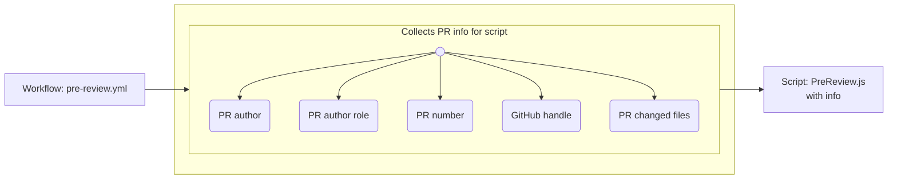

# Pre Review


Bind to a pre-review workflow, this is script that pre-review each PR contributions.

It provides custom feedback based on the submissions at 
a folder level (general feedback) and at a file level (feedback per files handled).
* E.g.: General feedback / folder level: file(s) missing, space contained in folder/file, file outside `Art/`...
* E.g.: File level feedback / file handled (html, css, json)


## ⚙️ How it works


### 🔹 Good to know
The script is able to:
- **Acknowledge the author's role** and **provide custom feedback accordingly**.
    - **admin** | **maintain** : feedback outside `Art/` are skipped, inside `Art/` remains  
    _(e.g.:  Maintainer doing non contribution work \ Maintainer doing the challenge /)_
    - **unknown** ( any non-maintainer ): will provide feedbacks for (in/out-side `Art/`)
- **Label PR**: based on the feedback output, the workflow will label the PR
    - `Changes Requested`: if any feedback are provided
    - `Awaiting Maintainer Validation`: if pre-review did not generated feedback
    - `hacktoberfest-accepted`: alongside `Awaiting Maintainer Validation` only if PR are occuring in October.

   Labels are removed automatically upon PR corrections.  
   _(except 'hacktoberfest-accepted' is assigned)_


### 🔹 Pre-review structure
```sh
🗂️ ./generators/pre-review
├── REAMDE.PRE-REVIEW.md    # Current Readme file
├── preReview.checkers.js 
├── preReview.constants.js  # Constants driving script
├── preReview.helpers.js
├── preReview.js            # Main script
└── preReview.reviewers.js
```

### 🔹 Terminologies
`constants`: Also holds configurable variables if project grow

`helpers`: Main script high-level helpers for main logic implementation  
_( contributionStates, helpers functions , ...)_

`checkers`: Checkers for scoped category review
_( globally, HTML, CSS, JSON )_

`reviewers`: Responsible for generating feedback. 
- Overal reviewer functions: establish feedback without checking file content  
- Individual reviewer functions: establish feedback per file and its content

---

<br/>

### Code info: 
If any questions feel free to reach out  
_Author: @LaurelineP_  | _Last Update: 10/2025_